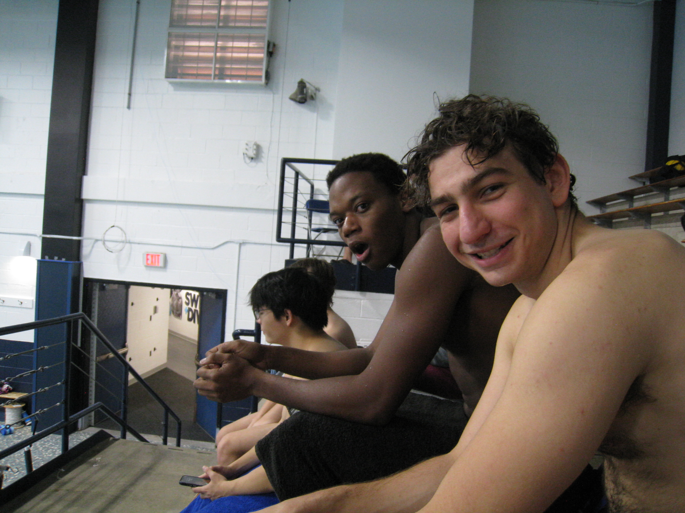

# CMU Men’s Water Polo Club Website 🏊‍♂️

A lightweight, mobile-first site that showcases Carnegie Mellon’s Men’s Water Polo Club, centralizing news, roster highlights, and resources for current and prospective players. Built for speed and easy maintenance, the project lives on **GitHub Pages** for zero-cost hosting and continuous deployment.

---

## 🌐 Live Site  
<https://ryanw-2.github.io/cmu-waterpolo/>

---

## 📸 Preview  
<!-- Replace the link below with an actual screenshot once one is committed -->


---

## 🛠️ Tech Stack
| Layer | Tools & Frameworks |
|-------|--------------------|
| Front-end | **React (vite)** |
| Styling  | **Tailwind CSS** + custom CSS |
| Routing  | `react-router-dom` |
| Animations/UX | `react-card-flip`, CSS transitions |
| Deployment | **GitHub Pages** (Actions) |

---

## 📊 Language Breakdown


---

## 🚀 Quick Start

```bash
# clone the repo
git clone https://github.com/ryanw-2/cmu-waterpolo.git
cd cmu-waterpolo

# install dependencies
npm install

# run locally
npm run dev
